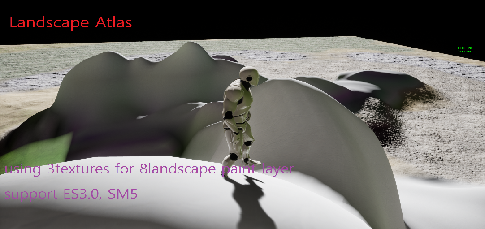
# ue4 landscape atlas

* 텍스쳐 3장으로 8개의 랜드스케이프 레이어/브러쉬를 구현
* gles3.0 이상,  sm5 지원
* 2048 텍스쳐 두장에 8장의 1024 텍스쳐 추가
* 2048 텍스쳐 한장에 rgba 채널별 8장의 노멀 추가
* 채널별 압축손실,srgb에 의한 문제를 피하기 위해 마스크로 임포트됨
* GLes3.0을 지원하는 미드레인지 이상의 모바일에서도 사용가능해야하며 PC에서도 볼만 해야 함
* 가능한 많은 테마의 지역을, 하나의 머티리얼로, 최소한의 리소스를 사용하여 구현할 수 있도록 하는 것이 목적
* 8브러쉬당 3장의 텍스쳐를 사용하고 옵션으로 마스킹 텍스쳐 사용시 1장당 16개의 마스킹 텍스쳐 사용가능.
* 몇몇 문제점을 해결하지 못해 개발 중단
* 도움을 준다면 반영 하겠음

## 발생한 버그
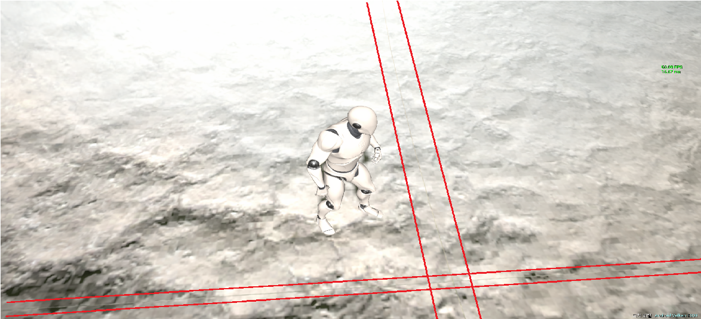
* LOD계산시 문제로 인한 경계부분 텍스쳐 에러

---
## 프로젝트 적용 방법
### 매우 간단한 사용방법
1. MTI_AtlasLandscape을 연다. 
2. 2048 사이즈의 아틀라스 텍스쳐 두장을 넣는다.
3. 2048 사이즈의 아틀라스 노멀맵 한장을 넣는다.
4. 노멀맵은 rg채널만 사용해 첫번째 텍스쳐와 동일한 순서로 제작하고 ba 채널을 사용해 두번째 텍스쳐와 동일한 순서로 제작한다.
5. 노멀맵 임포트 옵션에 가서 마스크로 변경하여 srgb를 사용하지 않게 한다.
6. 압축/포맷/srgb의 여부에 의해 각 채널별 할당된 색의 해상도가 달라지기 떄문에 바꿔주는것이다.
7. 랜드스케이프를 만들고 브러쉬를 해보자.
---

## 조금 복잡한 사용방법
노드를 추가하거나, 아틀라스 텍스쳐를 4k로 쓰고 싶거나, 브러쉬를 더 만들고 싶다면 여기부터 보자. 혹은 디버깅을 해주고 싶은분이 있다면 여기를 보자. MT_AtlasLandscape을 열어라.

### 브러쉬 사이즈
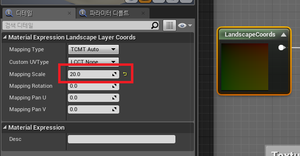
1. 브러쉬의 크기는 여기서 조절. 조금 내려가면 노멀도 동일한 노드가 있다.
2. 20을 입력했더니 3인칭 템플릿에서는 픽셀이 보임. 10정도로 해보자.
---

### 텍스쳐 사이즈

1. 텍스쳐 사이즈를 입력했음.
2. 노멀에도 같은 항목이 있다.
3. 이값을 머티리얼펑션으로 넘겨주었다는것 잊지말자
---

### 아틀라스 UV 와 밉레벨 얻음
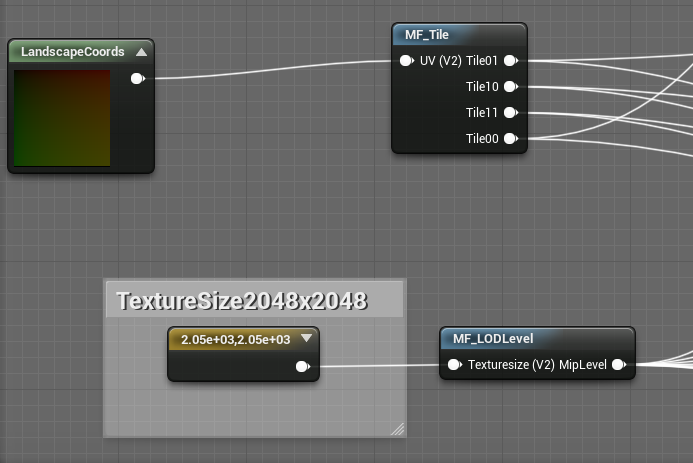
1. MF_Tile에서는 몇등분으로 나눠지는지 결정
2. MF_LODLevel에서는 텍스쳐에 입력할 밉레벨을 계산.
---

### 텍스쳐 파라메터
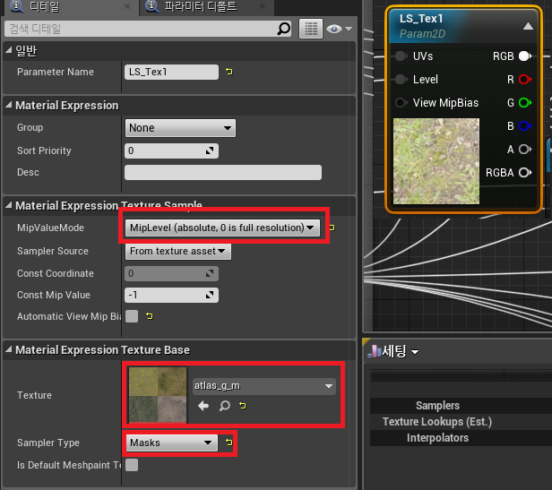
1. 아틀라스 텍스쳐를 드래그
2. 텍스쳐를 파라메터로 변경
3. 밉벨류를 밉레벨로 바꾸면 노드에서 레벨이 노출됨
4. 텍스쳐 옵션에서 샘플러 타입은 <b>컬러</b>로 변경. 임포트 옵션에서 기본으로 변경.
5. 글쓴이도 스샷찍고 글 타이핑 하다가 발견하고 급히 바꾸러갔음
6. 노멀맵은 텍스쳐 옵션에서 마스크/no srgb 여야 더 정확한 결과가 나올 것
7. 레벨에 MF_LODLevel 입력
8. 아래로 내려가면 노멀도 있는데 샘플러타입을 제외하면 여기까지는 동일함
---

### 랜드스케이프 레이어 블랜드
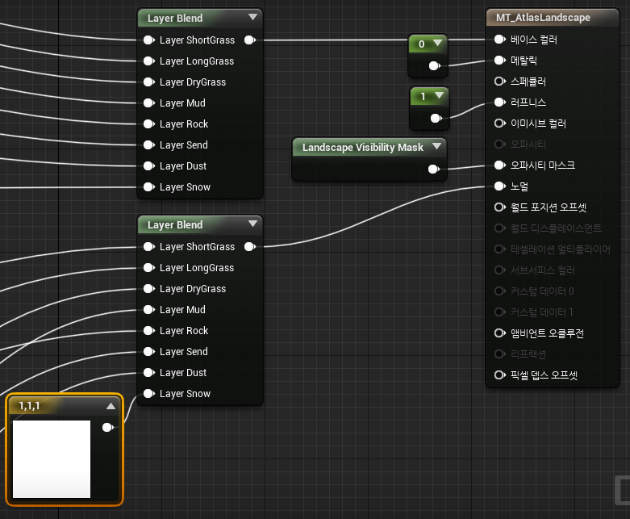
1. uv별로 자른 텍스쳐와 uv별로 자른 텍스쳐에서 채널별로 잘라서 만든 노멀맵을 레이어 블랜드 노드에 연결
2. snow의 경우 노멀맵이 잘못 들어가서 상수 vector3에 1/1/1로 입력했음
3. 수정 후 사용할 사람은 유일하게 비어있는 노드와 snow를 연결 할것
---

### 노멀맵 얻기
1. 이쪽은 조금 유의해야함. 피로에 의해 포토샵에서 복붙 작업중 노멀맵 아틀라스를 잘못 만들거나, 최초의 노멀값이 정규화 되지 않아있었거나, <B>공식에 문제가 있거나 하면</B> 노멀이 제대로 나오지 않을 수 있음
2. 눈을 크게 뜨고 채널별로 껏다 켯다 하며 프리뷰 값을 잘 살펴보아야함
3. RGBA 각 채널을 rgba로 표기하고 4등분 하여 좌상(top-left)부터 우하(bottom-right)까지를 각각 00,01,10,11으로 지칭함
4. 노멀의 r00, g00이 1번텍스쳐의 첫번째 레이어에 매칭됨
5. 노멀의 r01,g01이 1번텍스쳐의 두번째 레이어에 매칭, 노멀b00,a00이 2번텍스쳐의 첫번째 레이어에 매칭됨
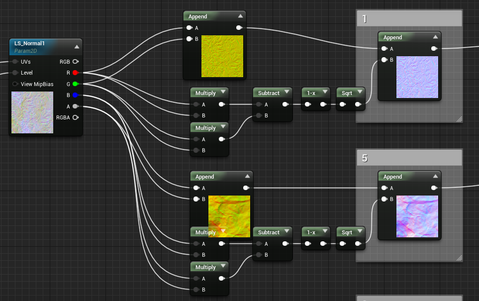
6. rg값으로 b값을 계산 하고 세값을 합쳐 최종 노멀을 산출함
7. r == r
8. g == r
9. b == sqrt(1 - (pow(R) - pow(G))
10. 다시 강조하지만 계산의 결과물과 원본을 비교해보고 제대로 나왔는지 확인
---
---

### MF_TILE
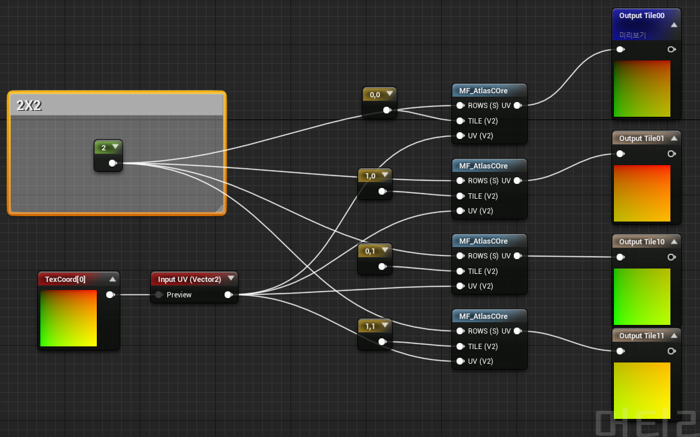
1. UV를 계산해냄
2. 몇 조각으로 쪼갤지 여기서 조절함
3. 기본 가로세로2/2
---

### MF_AtlasCore
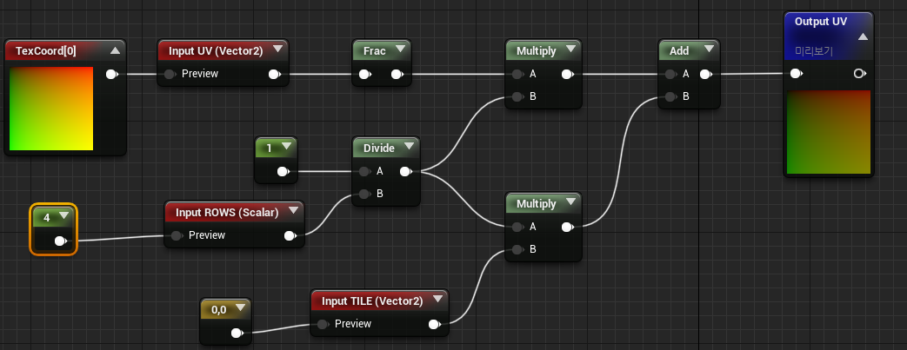
1. UV를 적절하게 계산함
---

### MF_ComputeMiplevel
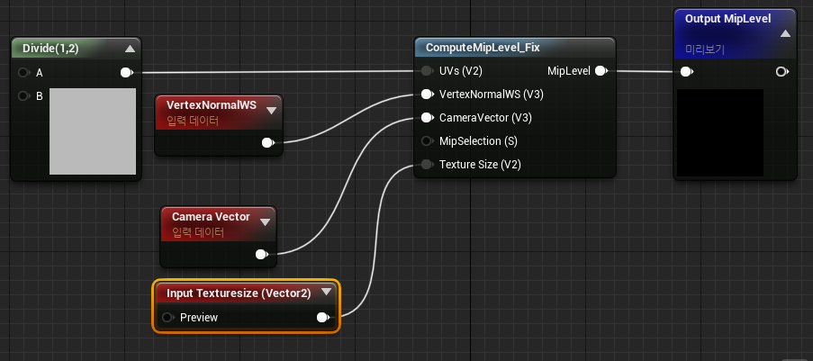
1. 밉레벨을 계산하는 부분으로 기본 노드인 ComputeMiplevel을 수정해 거리에 대한 변수를 고려하게 함.
2. 인터넷서 퍼왔음.
3. 사실 이 부분은 잘 모름. 값이 들어오는지를 알 수가 없다.
4. sorry

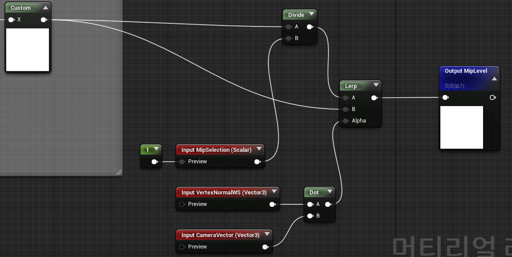

5. ComputeMiplevel을 복제해 ComputeMiplevelFix를 만듬
6. 기존 노드 뒤쪽에 Custom 뒤로 다음 내용들이 추가됨.
---
